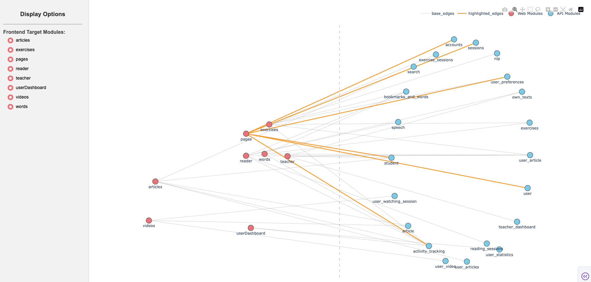

# Zeeguu Reconstruction

To better understand the module relationships between fronted and backend of Zeeguu project, 
the system provide an automatic way to visualize the relationships with a Module View. 

Run this command on the root folder to test at your local:

``python3 app.py``
